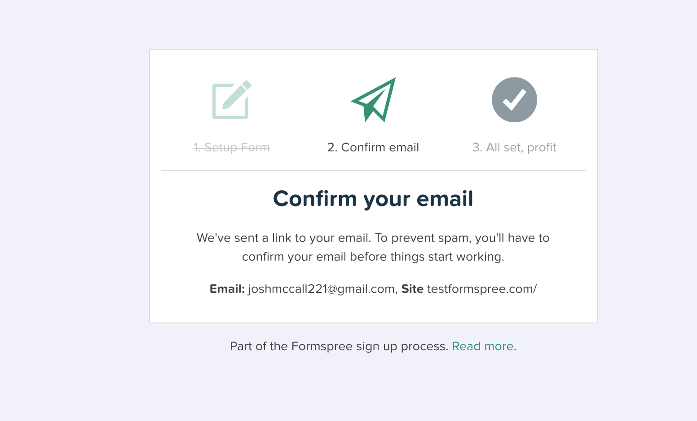
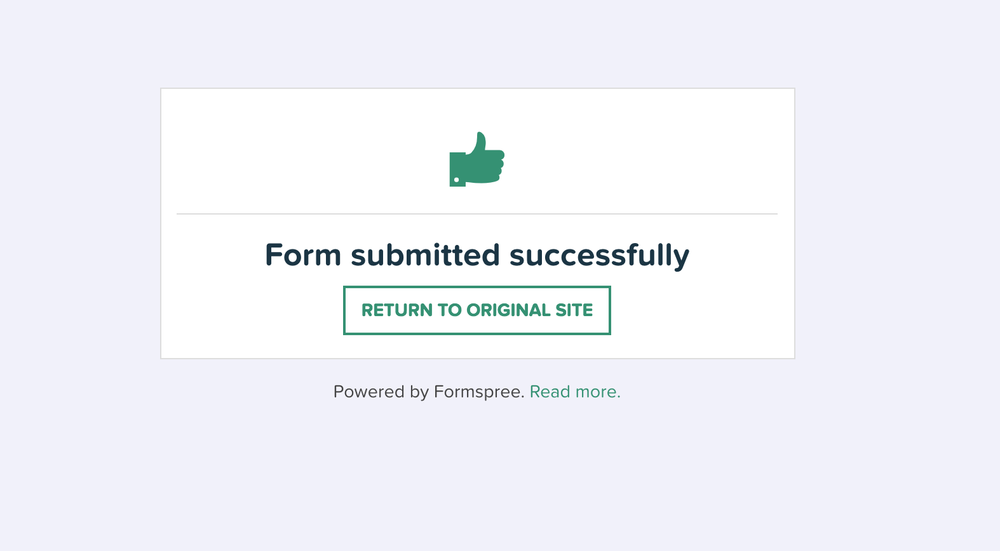
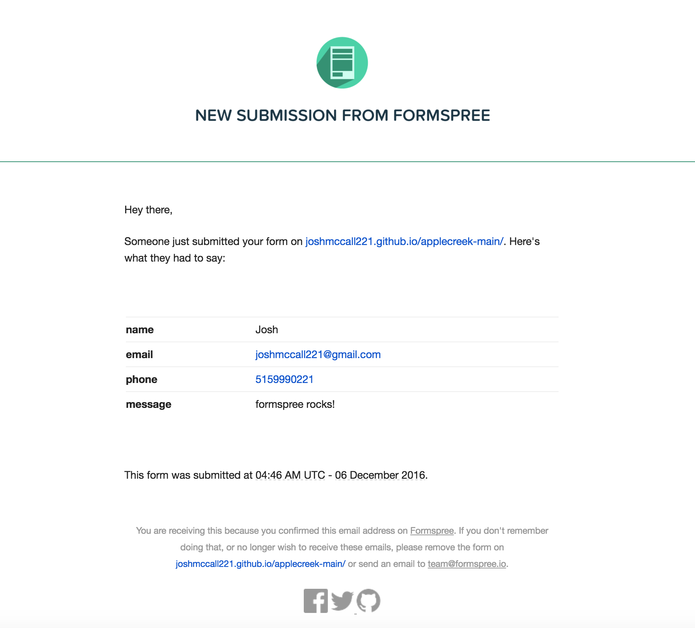

# Email form with formspree.io

## Doing more with static sites
I am a big fan of Jekyll. Generated static site hosted on gh-pages and now the ability to send email previously reserved for the back end, what's not to love? 

## Demo
Working on gh-pages (*note*: emails will go to me):  
* https://joshmccall221.github.io/applecreek-main/
* https://github.com/joshmccall221/applecreek-main


## Step 1: 

* Update form to use formspree.io form

```
<form action="https://formspree.io/your@email.com"
      method="POST">
    <input type="text" name="name">
    <input type="email" name="_replyto">
    <input type="submit" value="Send">
</form>
```

## Step 2 : 

* Run and test locally 

```bash
gem install jekyll bundler
bundle install
jekyll serve 
# Server address: http://127.0.0.1:4000/
```

## Step 3 : 

* Confirm email (only first email)



* Submit test email 



## Step 4 : 

* Deploy

```bash
git commit -am "adding formspree.io emailing"
checkout -b gh-pages
git push
```


* Test live form


* Read emails! :)


