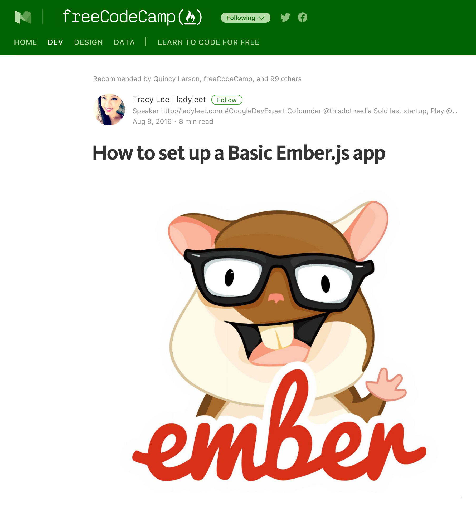

# From 0 to _
## Why wait?
### How to Teach Yourself Code
> "Stop waiting for the perfect technical co-founder and actually learn to code"

#### Video:
<iframe width="560" height="315" src="https://www.youtube.com/embed/T0qAjgQFR4c" frameborder="0" allowfullscreen></iframe>

## Getting started

### Free Code Camp
So you wanna learn to code... but where to start?

This is a big topic. If javascript (JS) is where you wanna be I would checkout [Free Code Camp(FCC)](https://www.freecodecamp.com/). Free code camp is probably my favorite thing on the internet!

Getting stuck on a challenge? Here is a link to my solutions.... but shh, you didn't get this from me. ;)

[freecodecamp ( joshmccall221 )](https://www.freecodecamp.com/joshmccall221)

### Whats next?

Got the basics covered? Ready to level up to app development? Check out ember.js! The community, the resources and the framework make it easier for beginners to get things done. To see what I mean, check out [@ladyleet's](https://twitter.com/ladyleet)  write up.

#### How to set up a Basic Ember.js app
See: [How to set up a Basic Ember.js app](https://medium.freecodecamp.com/setting-up-a-basic-ember-js-app-c9323760c675)

> note: if you're new/haven't set up your machine for develpment, see below section on [Tools](#tools).

### Tools
If your following along with the blog... consider using [ember Twiddle](ember-twiddle.com):

### Ember Super-Rentals
Ready for the next step? Follow the supper-rentals tutorial, you'll have an app running in no time!

> See: [Super-Rentals ](https://guides.emberjs.com/v2.16.0/tutorial/ember-cli/)

### But what about mobile?

#### Building Performant Hybrid Apps with Ember
<iframe width="560" height="315" src="https://www.youtube.com/embed/UL7OkXyT_2o" frameborder="0" allowfullscreen></iframe>

## Conclusion

Ready for more and need more suggestions? Have a resource that should be listed here? Leave a comment below or reach out to [@joshmccall](https://twitter.com/joshmccall)!

