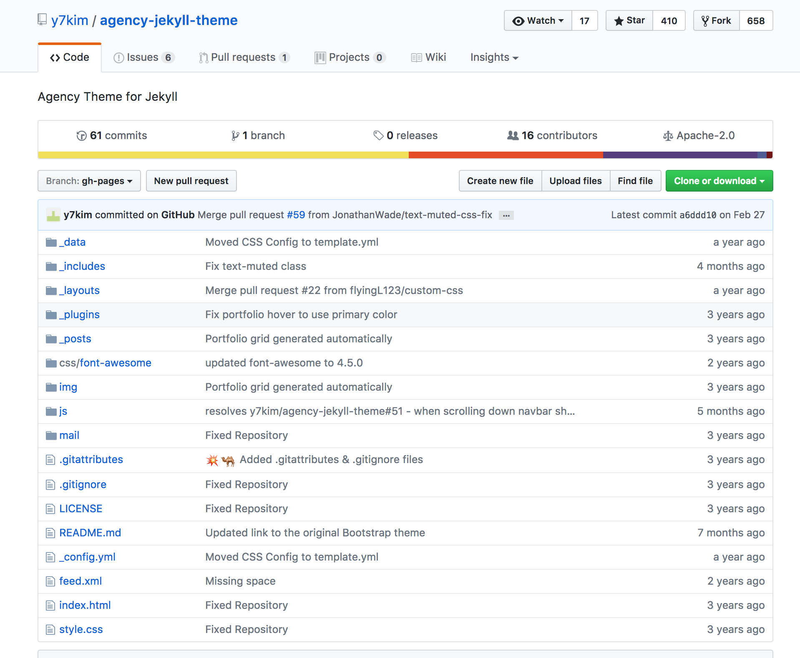
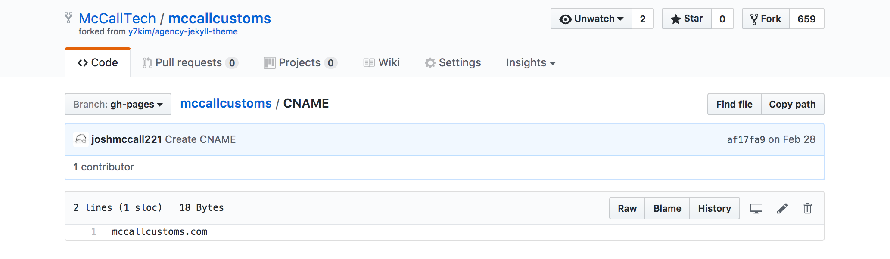
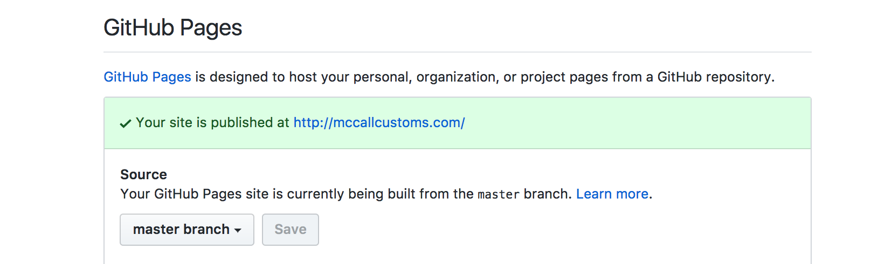
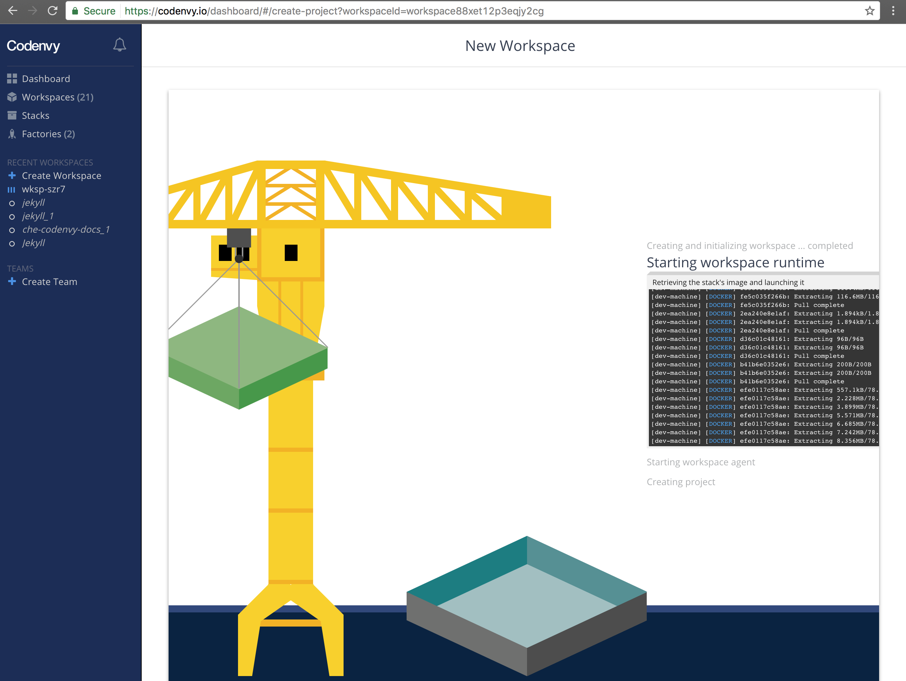

#Jekyll: lets talk about it!
## @dsmwebgeeks

## Josh McCall


  [joshuamccall.com](joshuamccall.com)
| [<i class="fa fa-github"  aria-hidden="true"></i> joshmccall221](https://github.com/joshmccall221/gitbook)
| [<i class="fa fa-twitter" aria-hidden="true"></i> joshmccall](https://twitter.com/joshmccall)
| [<i class="fa fa-twitter" aria-hidden="true"></i> gaincompliance](https://twitter.com/gaincompliance)


## @mtravi @ @dsmjs 
 

### Goals for this talk
- Why
- What
- How

### Goals for this talk
- Why
- What
- How
- Other tools!!!

## Why
- Anyone have a Jekyll site, blog, portfolio etc.?


### Crafting a Brand
- Personal Brand: [Personal Brand](../articles/personal_brand.md)
- Portfolio w/ Jekyll: [Building personal websites with Github and Jekyll](../articles/jekyll/jekyll.md)
- Bloggin w/ Gitbook: [Gitbook: Getting started](http://joshuamccall.com/articles/gitbook.html)
- Better Resumes w/ HackMyResume: [HackMyResume + JSON Resume](http://joshuamccall.com/articles/hackmyresume.html)


## Why

- Clients, friends and family, projects...## What is "Static Sites with Jekyll"


Site: https://jekyllrb.com/## Why Static?

- No database
- Faster
- Secure
- Less Maintenance
- Lower Cost
- Blog Aware
- Markdown## What is Jekyll?
- Blog-aware
- Static site generator
- Markdown / Liquid## Who uses Jekyll?### GitHub Pages


### Tom Preston-Werner (Founder of Github)

  [<i class="fa fa-github"  aria-hidden="true"></i> mojombo](https://github.com/mojombo)
| [tom.preston-werner.com](http://tom.preston-werner.com/)

Blogging Like a Hacker ([Link](http://tom.preston-werner.com/2008/11/17/blogging-like-a-hacker.html))
>"The system is simple enough that I can keep the entire conversion process in my head. The distance from my brain to my blog has shrunk, and, in the end, I think that will make me a better author."

### Obama campaign's $250 million fundraising platform


### Kyle Rush
 

[Meet the Obama campaign's $250 million fundraising platform](http://kylerush.net/blog/meet-the-obama-campaigns-250-million-fundraising-platform/)
- Static HTML pages generated by Jekyll
- Served by Akamai CDN, origin hosted on Amazon S3
- Version control with GitHub

>"We made the new platform 60% faster and this resulted in a 14% increase in donation conversions."


[<i class="fa fa-podcast" aria-hidden="true"></i> Podcast 54: Jekyll and CMS-less websites with Young Hahn and Dave Cole](http://5by5.tv/webahead/54)

[<i class="fa fa-hacker-news" aria-hidden="true"></i> Hacker News](https://news.ycombinator.com/item?id=4842510)

### React


([Link](https://github.com/facebook/react/tree/master/docs))

### Lean TECHniques

([Link](http://www.leantechniques.co/))


## What is Jekyll

# How do you use it?

## Find a theme

 

## Fork a theme

 
 

## Settings

## _config

 ## Settings


## Tada!!!!


([Link](https://joshmccall221.github.io/agency-jekyll-theme/))

## _configure.yml   _layout
```
note: if file does not load, scroll left/right (silly github!)
```
<script src="https://gist.github.com/joshmccall221/9edbfdb101e1a0583af97fd7e1021025.js"></script>

([code](https://github.com/joshmccall221/agency-jekyll-theme))
([Link](https://joshmccall221.github.io/agency-jekyll-theme/))

## _site

```
$ jekyll build
=> The current folder will be generated into ./_site
```

## CNAME

 
 

[code](https://github.com/McCallTech/mccallcustoms/blob/gh-pages/CNAME)
[Link](http://mccallcustoms.com/)

## Hands on with Codenvy

### [codenvy.io](https://codenvy.io/site/login)


### New workspace


> FROM sunix/jekyll4che


### Click save


### Add your project


### Click Create


### Create a new custom command and save

>Name: Run Jekyll

>Command line: cd $(ls /projects/) && jekyll serve --host=0.0.0.0

>Preview URL: http://${server.port.4000}/


### Run command and visit the preview link


### Enjoy your cloud dev environment!!!


## Tools and Links
- [google.com/search?q=jekyll](google.com/search?q=jekyll)
- [StaticGen - Top Open-Source Static Site Generators](https://www.staticgen.com/ )
- [jekyll-admin ](https://github.com/jekyll/jekyll-admin)
- [Docker](https://github.com/jekyll/docker )
- [Logos](https://github.com/jekyll/brand )

### Serverless resources
- http://nobackend.org/
- https://backendless.com/
- http://unhosted.org/
- https://staticapps.org/
- https://serverless.com/blog/
- https://coryrylan.com/blog/fast-and-secure-blogs-with-firebase
- [Coding Architecture: When you need a 3 tier architecture](http://www.codingthearchitecture.com/2012/07/20/when_do_you_need_a_3_tier_architecture.html)

### Planet Jekyll
- [Planet Jekyll - Showcase ](http://planetjekyll.github.io/showcase/ )
- [Planet Jekyll - Editors]( https://github.com/planetjekyll/awesome-jekyll-editors )

### Themes
- [themeforest](https://themeforest.net/category/static-site-generators/jekyll )
- [jekyllthemes.io ](https://jekyllthemes.io/)
- [jekyllthemes.org](http://jekyllthemes.org/)
- [jekyllrc](http://themes.jekyllrc.org/)


### Local Sites
- http://ottumwa1stchurch.com/
- https://jimsapplservice.github.io/
- http://mccallcustoms.com/
- https://github.com/AppleCreekIowa/applecreek-main/pull/1
- http://www.leantechniques.co/

## talks

### Jekyll Conf
http://jekyllconf.com/

#### Doing A Lot With A Little - David Darnes / JekyllConf 2016
- https://www.youtube.com/watch?v=Y4qwpN40Dvg
- http://slides.com/daviddarnes/deck-1#/3
  - eCommerce
  - Site Search
  - Contact forms
    - https://formspree.io/

#### Continuous Deployment Of Jekyll Sites Powered By Docker - David Von Lehman / JekyllConf 2016
- https://youtu.be/wMlPlKCZfEk
- https://bitbucket.org/aerobatic/jekyll-cd-slides/src/c80720459e87?at=master
- Slides: https://bitbucket.org/aerobatic/jekyll-cd-slides/src/c80720459e87f51b49b42f3b2aa8a260bddb9c92/_slides/007-dockerfile.html?at=master&fileviewer=file-view-default

#### Getting Started With Jekyll
- [Getting Started With Jekyll, The Static Site Generator ](https://youtu.be/iWowJBRMtpc?list=PLrQsVT7x8HYGRo4WGKsjXx1cRAE8EAHgp)

### Introducing and Launching Jekyll 3.0
- https://www.youtube.com/watch?v=sPZK8w55cBQ&index=3&list=PLrQsVT7x8HYGRo4WGKsjXx1cRAE8EAHgp
- Parker Moore (parkr) - Maintainer
  - Interview: https://www.netlify.com/blog/2016/03/11/interview-with-parker-moore-from-jekyll/
  - Site: https://byparker.com/

### Converting a static site to Jekyll - CloudCannon Casts
- https://youtu.be/yXXj9oYFXRI?list=PLrQsVT7x8HYGRo4WGKsjXx1cRAE8EAHgp
- source : https://github.com/CloudCannon/creative-jekyll-theme/

### Building Our Agency Site With Jekyll - David Jones / JekyllConf 2016
- https://youtu.be/4XxYQ7efk0E?list=PLrQsVT7x8HYGRo4WGKsjXx1cRAE8EAHgp
- site: https://resolve.digital/services/
- Jekyll import (RSS feed)

### Design + Code — Hour 8.2: Jekyll Blog Loop
- https://www.youtube.com/watch?v=FiJuoFg_Ipc&list=PLrQsVT7x8HYGRo4WGKsjXx1cRAE8EAHgp&index=10

### Youtube Playlist:
- https://www.youtube.com/playlist?list=PLrQsVT7x8HYGRo4WGKsjXx1cRAE8EAHgp

## Blogs / Resources
- [jekyll-v-ghost-creating-a-new-blog-and-why-i-did-it-the-hard-way](http://www.andrewsouthpaw.com/2014/12/05/jekyll-v-ghost-creating-a-new-blog-and-why-i-did-it-the-hard-way/)
- [blogging-platform-comparison](http://bitsandbites.me/blog/2014/07/01/blogging-platform-comparison/)
- [performant-websites-with-jekyll-grunt-github-pages-and-cloudflare](http://davidensinger.com/2015/01/performant-websites-with-jekyll-grunt-github-pages-and-cloudflare/)
- [Jekyll-Angular-Firebase (JAF) stack ](http://maxhorstmann.net/blog/2014/09/10/web-apps-with-no-backend-code-the-jekyll-angular-firebase-jaf-stack/)
- [jekyll-angular-firebase](https://github.com/MaxHorstmann/jekyll-angular-firebase)
- [Migrating from Ghost to Jekyll ](https://andy.stanton.is/writing/about/migrating-from-ghost-to-jekyll/)
- [Save 50 Hours Setting up Your Jekyll Blog](http://willkoehler.net/2014/08/26/save-50-hours-setting-up-your-jekyll-blog.html)
- [Automate GitHub Pages publishing with Jekyll and Travis CI](http://eshepelyuk.github.io/2014/10/28/automate-github-pages-travisci.html)
- [Blogging with Jekyll + Github and Medium vs other platforms. ](https://medium.com/@srnvs/blogging-with-jekyll-github-and-medium-vs-other-platforms-efcc316327e1)
- [build-blog-jekyll-github-pages](https://www.smashingmagazine.com/2014/08/build-blog-jekyll-github-pages/)
- [How To Schedule Posts for Static Site Generators (Jekyll, Hugo, Phenomic etc.) ](https://serverless.com/blog/static-site-post-scheduler/)

## Ember
- [Ember Start Boostrap Agency](https://www.emberjsthemes.com/themes/view-theme.php?theme_id=1004)
- [ember-fastboot](https://github.com/ember-fastboot/fastboot-website)

```
git clone https://github.com/ember-fastboot/fastboot-website
cd fastboot-website
npm install
ember serve
Visit the app at http://localhost:3000.
```

### robwebdev: [ember-cli-static-site-website](https://github.com/robwebdev/ember-cli-static-site-website)
- [Static: ember-fastboot](https://github.com/robwebdev/fastboot-website)
- [ember-cli-static-site](https://github.com/robwebdev/ember-cli-static-site)
- [Rethinking Static Sites](http://kellysutton.com/2015/05/19/rethinking-static-sites.html)
- [Using Ember CLI as a Single Page Static Site Generator](https://medium.com/@jlsuttles/using-ember-cli-as-a-single-page-static-site-generator-62e4111b13db)
- [Kickstarting a static website with ember.js and handlebars.js](https://roussos.cc/2013/10/20/kickstarting-a-static-website-emberjs-handlebarsjs/)
- [ember-static](http://slides.com/eubenesa/ember-static#/5)

### Questions?
