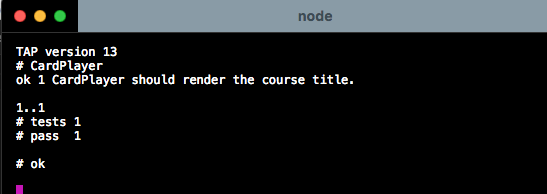

# Riding shotgun with Elliot ([Lifetime Access Pass](https://ericelliottjs.com/product/lifetime-access-pass/))


## Useful Links
---------------------------------------

### ericelliottjs.js
* [Premium content dashboard](https://ericelliottjs.com/premium-content/)
    * [Shotgun with Eric Elliott – Episode 1](https://ericelliottjs.com/premium-content/shotgun-with-eric-elliott-episode-1/)

### Medium
* [Medium-Shotgun: JavaScript Video Experience](https://medium.com/javascript-scene/shotgun-javascript-video-experience-c8b6a7771d49#.ji1oacpto)

### Word Press
* [ericleads wordpress](https://ericleads.wordpress.com/)

### Github
* [github - ericelliott/react-pure-component-starter](https://github.com/ericelliott/react-pure-component-starter)

## Shotgun with Eric Elliott – Episode 1 :
---------------------------------------

This is mostly notes / recap for myself as I don't want to give away Eric's hard work. For the video and full content visit [Shotgun with Eric Elliott – Episode 1](https://medium.com/javascript-scene/shotgun-javascript-video-experience-c8b6a7771d49#.ji1oacpto).

>This video is a great overview of the TDD process with React components. Some of the stuff you’ll see in this episode:
>* Unit testing with Tape
>* Auto-lint & test with watch
>* Enzyme (with a hitch)
>* Cheerio
>* Test-first methodology (Red/Green/Refactor workflow)

### Getting started: 
---------------------------------------

```
git clone https://github.com/jshomes/course-player.git && \
cd course-player && \
git checkout 249793ee8dd108ade47ff218c3492247d42b83f4 && \
nvm install 5.5 && \
npm install && \
npm run watch
```
### If all goes well....


