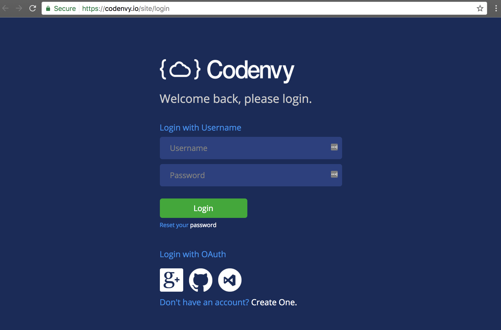
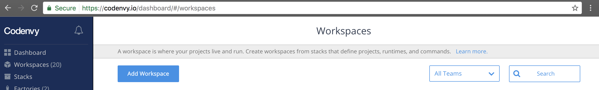
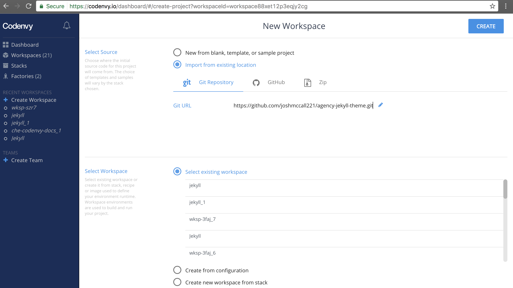

## Hands on with Codenvy

### [codenvy.io](https://codenvy.io/site/login)

### New workspace

> FROM sunix/jekyll4che

### Click save

### Add your project

### Click Create

### Create a new custom command and save

>Name: Run Jekyll

>Command line: cd $(ls /projects/) && jekyll serve --host=0.0.0.0

>Preview URL: http://${server.port.4000}/

### Run command and visit the preview link

### Enjoy your cloud dev environment!!!

